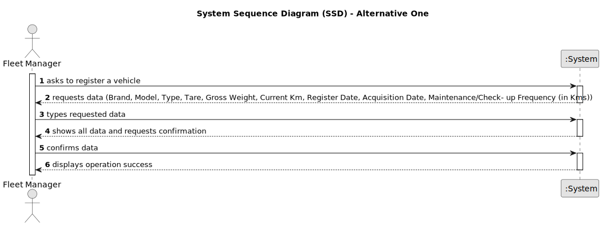

# US006 - Create a Task 

## 1. Requirements Engineering

### 1.1. User Story Description

As an FM, I wish to register a vehicle including Brand, Model, Type, Tare, Gross Weight, Current Km, Register Date, Acquisition Date, Maintenance/Check- up Frequency (in Kms)

### 1.2. Customer Specifications and Clarifications 

**From the specifications document:**

>	Each task is characterized by having a unique reference per organization, a designation, an informal and a technical description, an estimated duration and cost, as well as a task category. 

>	As long as it is not published, access to the task is exclusive to the employees of the respective organization. 

**From the client clarifications:**

> **Question:** For the application to work does the FM need to fill all the attributes of the vehicle?
>
> **Answer:** yes, besides the vehicle plate that by mistake doesn't appear on the text.

> **Question:** If the Fm inserts the same vehicle by mistake, should it inform ther user of the mistake and give him the option to add another vehicle?
>
> **Answer:** again, duplication of data is not a business rule is technical one, since by definition in a set you cant have duplicates.

### 1.3. Acceptance Criteria

* **AC1:** FM cant duplicate cars.
* **AC2:** Vehicles must be identified by the plate id.
* **AC3:** Show car data for confirmation.

### 1.4. Found out Dependencies

* This user story has no dependencies

### 1.5 Input and Output Data

**Input Data:**

* Typed data:
    * Brand, Model, Type, Tare, Gross Weight, Current Km, Register Date, Acquisition Date, Maintenance/Check- up Frequency (in Kms)
	
* Selected data:
 

**Output Data:**

* Confirmation of car data
* Car registration

### 1.6. System Sequence Diagram (SSD)

**_Other alternatives might exist._**

#### Alternative One

#### Alternative Two

!

### 1.7 Other Relevant Remarks

* 