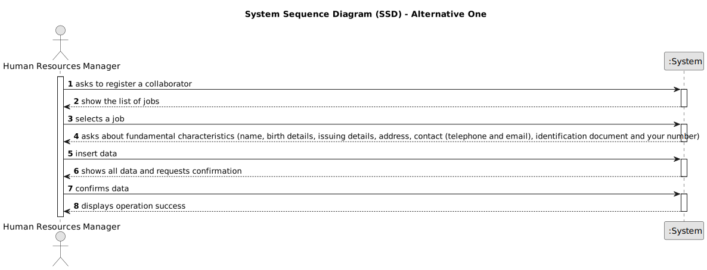

# US003 - Register a collaborator

## 1. Requirements Engineering

### 1.1. User Story Description

As an HRM, I want to register a collaborator with a job and fundamental characteristics.

### 1.2. Customer Specifications and Clarifications 

**From the specifications document:**

>	Thus, an employee has a main occupation (job) and a set of skills that enable him to perform/take on certain tasks/responsibilities, for example, driving vehicles of different types (e.g. light, or heavy), operating machines such as backhoes or tractors; tree pruning; application of phytopharmaceuticals.
 

**From the client clarifications:**

> **Question:** Which information is mandatory to insert a collaborator in the program (fundamental characteristics)?

> **Answer:** Name, birth date, admission date, address, contact info (mobile and email), taxpayer number, ID doc type and respective number

> **Question:** Does the HRM select the job from a list that we display?

> **Answer:** Displaying or not, It's a matter of UX, the dev team should decide about it, but the valid jobs are the ones created within the US02.

### 1.3. Acceptance Criteria

* **AC1:** The system must show the list of jobs.
* **AC2:** The system must associate the employee with the associated job.
* **AC3:** The system must show the data entered for the Human Resources Manager to confirm.

### 1.4. Found out Dependencies

* There is a dependency on "US002 - As an HRM, I want to register a job." because it will create the list of jobs that will later be chosen.

### 1.5 Input and Output Data

**Input Data:**

* Typed data:
    * job
    * name, birth details, issuing details, address, contact (telephone and email), identification document and your number

**Output Data:**

* List of jobs
* Shows all data

### 1.6. System Sequence Diagram (SSD)

**_Other alternatives might exist._**

#### Alternative One

#### Alternative Two

!

### 1.7 Other Relevant Remarks

*  