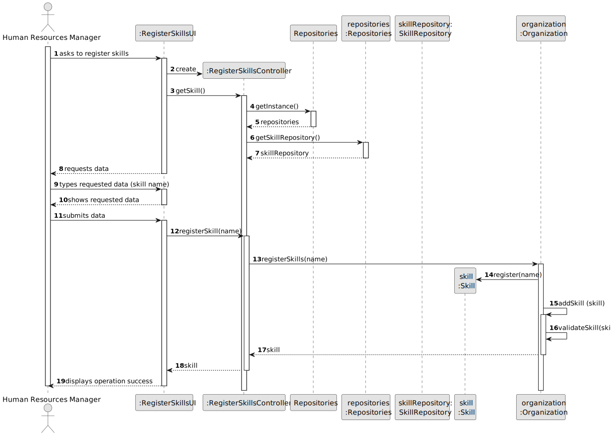
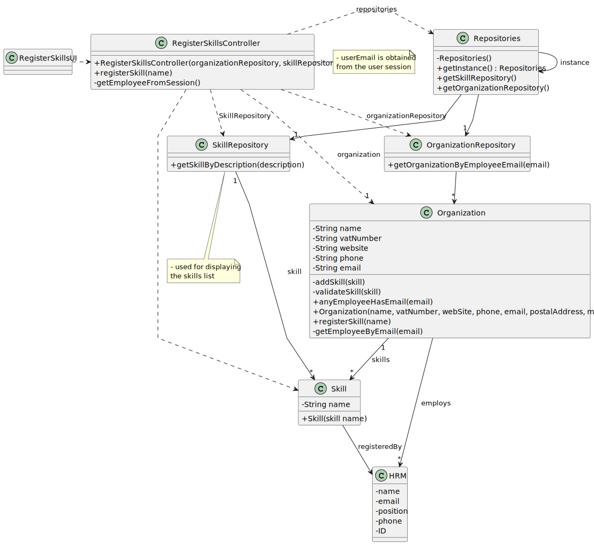

# US001 - Register Skills 

## 3. Design - User Story Realization 

### 3.1. Rationale

_**Note that SSD - Alternative One is adopted.**_

| Interaction ID | Question: Which class is responsible for...   | Answer                   | Justification (with patterns)                                                                                 |
|:---------------|:----------------------------------------------|:-------------------------|:--------------------------------------------------------------------------------------------------------------|
| Step 1  		     | 	... interacting with the actor?              | RegisterSkillsUI         | Pure Fabrication: there is no reason to assign this responsibility to any existing class in the Domain Model. |
| 			  		        | 	... coordinating the US?                     | RegisterSkillsController | Controller                                                                                                    |
| 			  		        | 	... registering a new skill?                 | HRM                      | Creator (Rule 1): in the DM HRM registers the skills.                                                         |
| 			  		        | ... knowing the user using the system?        | UserSession              | IE: cf. A&A component documentation.                                                                          |
| Step 3  		     | 	...saving the inputted data?                 | Skill                    | IE: object created in step 1 has its own data.                                                                |
| Step 4		       | 	... validating all data (local validation)?  | Skill                    | IE: owns its data.                                                                                            |  
| 			  		        | 	... saving the registered skill?             | SkillRepository          | IE: owns all its skills.                                                                                      | 
| Step 5  		     | 	... informing operation success?             | RegisterSkillsUI         | IE: is responsible for user interactions.                                                                     | 

### Systematization ##

According to the taken rationale, the conceptual classes promoted to software classes are: 

* Organization
* Skill

Other software classes (i.e. Pure Fabrication) identified: 

* RegisterSkillsUI  
* RegisterSkillsController

## 3.2. Sequence Diagram (SD)

_**Note that SSD - Alternative One is adopted.**_

### Full Diagram

This diagram shows the full sequence of interactions between the classes involved in the realization of this user story.

## 3.3. Class Diagram (CD)

