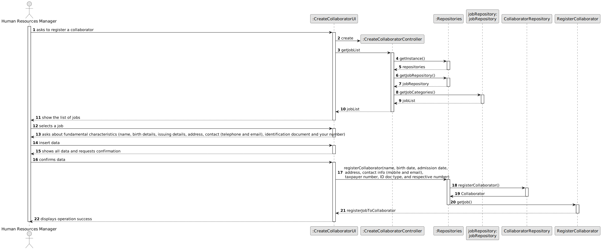
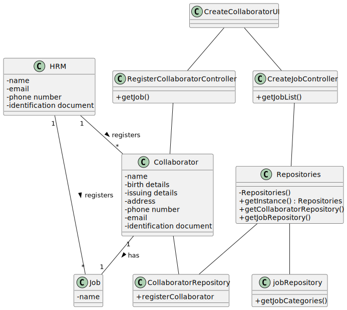

# US003 - As an HRM, I want to register a collaborator with a job and fundamental characteristics.

## 3. Design - User Story Realization 

### 3.1. Rationale

_**Note that SSD - Alternative One is adopted.**_

| Interaction ID | Question: Which class is responsible for...  | Answer                                    | Justification (with patterns)                                                                                 |
|:---------------|:---------------------------------------------|:------------------------------------------|:--------------------------------------------------------------------------------------------------------------|
| Step 1  		     | 	... interacting with the actor?             | CreateCollaboratorUI                      | IE: is responsible for user interactions.  |
| 			  		        | 	... coordinating the US?                    | CreateJobController                       | Controller                                                                                                    |
| Step 2  		     | 	...saving the inputted data?                | jobRepository                             | IE: object created in step 1 has its own data.                                                                |
| Step 3  		     | 	... saving the selected category?           | CollaboratorRepository                    | IE: object created in step 1 is classified in one Category.                                                   |
| Step 4  		     | 	... validating all data (local validation)? | RegisterCollaborator                      | IE: owns its data.                                                                                            | 
| 			  		        | 	... saving the created collaborator?        | RegisterCollaborator                      | IE: owns all its tasks.                                                                                       | 
| Step 5  		     | 	... informing operation success?            | CreateCollaboratorUI                      | IE: is responsible for user interactions.                                                                     | 

### Systematization ##

According to the taken rationale, the conceptual classes promoted to software classes are: 

* jobRepository
* RegisterCollaborator

Other software classes (i.e. Pure Fabrication) identified: 

* CreateCollaboratorUI  
* CreateCollaboratorController

## 3.2. Sequence Diagram (SD)

_**Note that SSD - Alternative Two is adopted.**_

### Full Diagram

This diagram shows the full sequence of interactions between the classes involved in the realization of this user story.

## 3.3. Class Diagram (CD)

