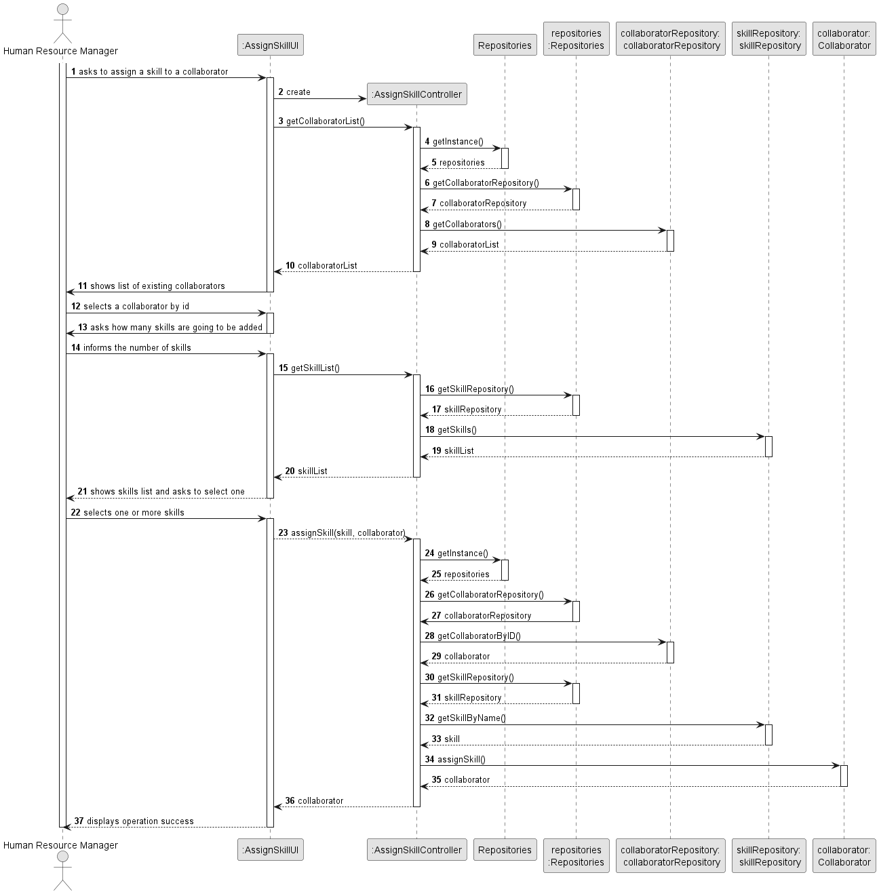
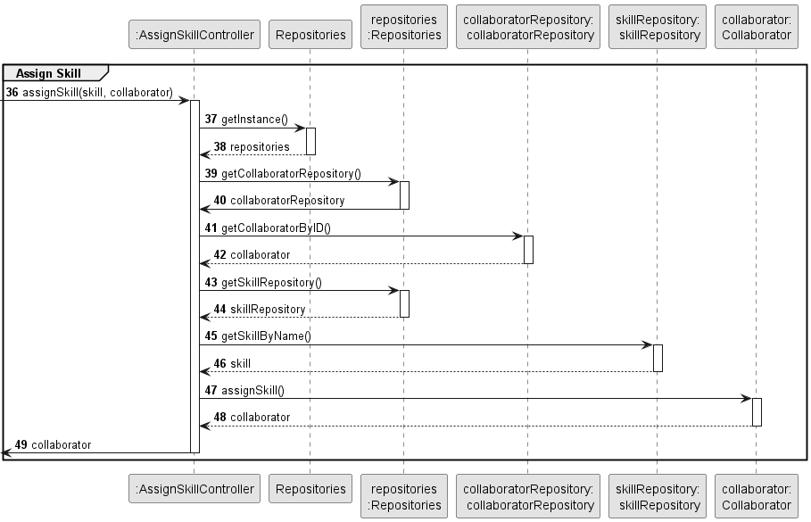
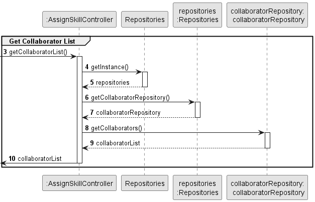
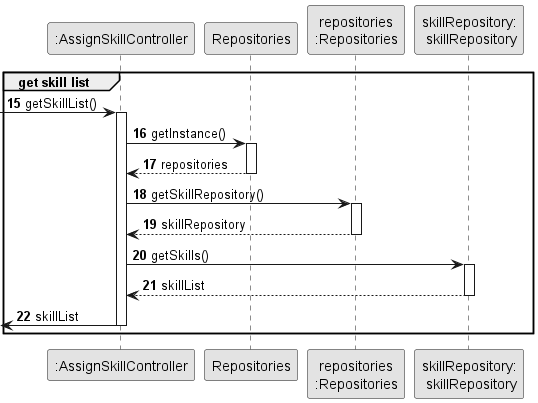
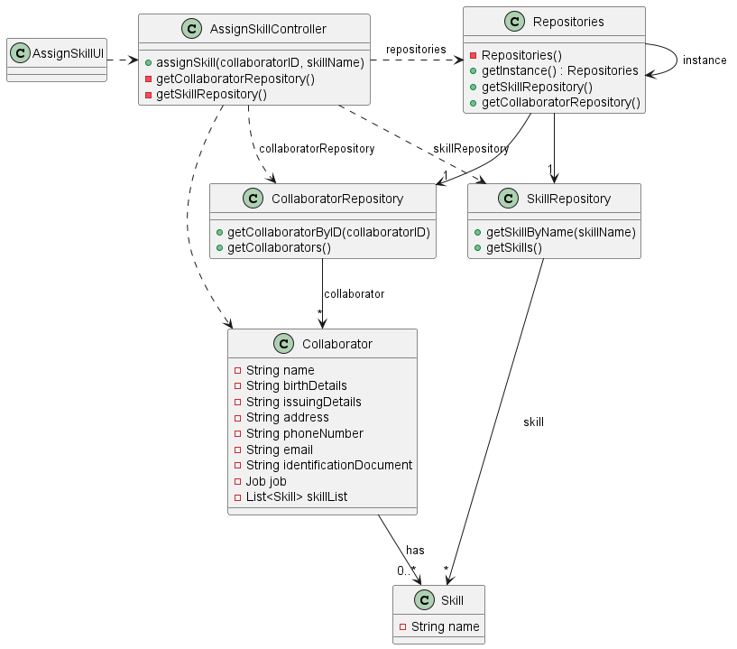

# US004 - Assign a skill 

## 3. Design - User Story Realization 

### 3.1. Rationale

| Interaction ID | Question: Which class is responsible for...                   | Answer                 | Justification (with patterns)                                                                                                           |
|:---------------|:--------------------------------------------------------------|:-----------------------|:----------------------------------------------------------------------------------------------------------------------------------------|
| Step 1  		     | 	... interacting with the actor?                              | AssignSkillUI          | Pure Fabrication: there is no reason to assign this responsibility to any existing class in the Domain Model.                           |
| 			  		        | 	... coordinating the US?                                     | AssignSkillController  | Controller                                                                                                                              |
| 			  		        | 	... adding the skills?                                       | Collaborator           | IE: The skills will be stored in the collaborator that has them making it the only class that makes sense to be used to add it's skills |
| Step 2  		     | 							                                                       |                        |                                                                                                                                         |
| Step 3  		     | ... retrieving the typed collaborator associated with the ID	 | CollaboratorRepository | IE: Knows all its collaborators.                                                                                                        |
| Step 4  		     | 	                                                             |                        |                                                                                                                                         |
| Step 5  		     | 	                                                             |                        |                                                                                                                                         |
| Step 6  		     | 	... retrieving the list?                                     | SkillRepository        | IE: Knows all its skills.                                                                                                               |              
| Step 7  		     | 	... saving the selected skills?                              | Collaborator           | IE: object that has a skill list associated.                                                                                            |
| Step 8  		     | 	... informing operation success?                             | AssignSkillUI          | IE: is responsible for user interactions.                                                                                               | 

### Systematization ##

According to the taken rationale, the conceptual classes promoted to software classes are: 

* Collaborator
* Skill

Other software classes (i.e. Pure Fabrication) identified: 

* AssignSkillUI 
* AssignSkillController

## 3.2. Sequence Diagram (SD)

### Full Diagram

This diagram shows the full sequence of interactions between the classes involved in the realization of this user story.

### Split Diagrams

The following diagram shows the same sequence of interactions between the classes involved in the realization of this user story, but it is split in partial diagrams to better illustrate the interactions between the classes.

It uses Interaction Occurrence (a.k.a. Interaction Use).

**Assign Skill to the Collaborator**

**Get Collaborator List**

**Get Skill List**

## 3.3. Class Diagram (CD)

