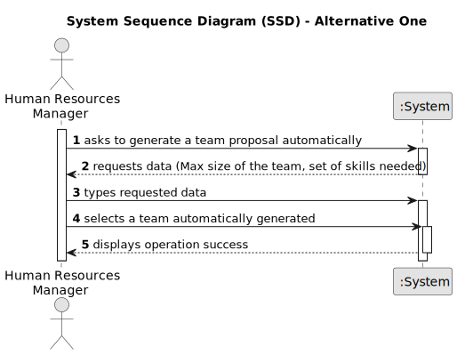

# US005 -  As a HRM, I want to generate a team proposal automatically.

## 1. Requirements Engineering

### 1.1. User Story Description

As a HRM, I want to generate a team proposal automatically.
### 1.2. Customer Specifications and Clarifications 

**From the specifications document:**

>	Each task is characterized by having a unique reference per organization, a designation, an informal and a technical description, an estimated duration and cost, as well as a task category. 

>	As long as it is not published, access to the task is exclusive to the employees of the respective organization. 

**From the client clarifications:**

> **Question:** Which is the unit of measurement used to estimate duration?
>
> **Answer:** Duration is estimated in days.

> **Question:** Monetary data is expressed in any particular currency?
>
> **Answer:** Monetary data (e.g. estimated cost of a task) is indicated in POT (virtual currency internal to the platform).

### 1.3. Acceptance Criteria

* **AC1:** The maximum team size and the set of skills need to be supplied by the HRM.
* **AC2:** All required fields must be filled in.
* **AC3:** When creating a task with an existing reference, the system must reject such operation and the user must be able to modify the typed reference.

### 1.4. Found out Dependencies

* There is a dependency on US03 and US04.

### 1.5 Input and Output Data

**Input Data:**

* Typed data:
    * Max size of the team;
    * Set of skills needed;

**Output Data:**

* (In)Success of the operation

### 1.6. System Sequence Diagram (SSD)

**_Other alternatives might exist._**

#### Alternative One

### 1.7 Other Relevant Remarks

* The created task stays in a "not published" state in order to distinguish from "published" tasks.