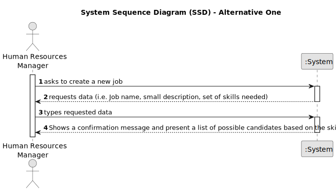

# US010 -  As a GSM, I want to know which piece(s) of equipment is/are
used in each day so that I can understand the users’ preferences.

## 1. Requirements Engineering

### 1.1. User Story Description

As an HRM, I want to register a job.

### 1.2. Customer Specifications and Clarifications 

**From the specifications document:**

>	“Tasks are carried out on an occasional or regular basis in one or more green spaces, for example: tree pruning; installation of an irrigation system; installation of a lighting system.
Teams are temporary associations of employees who will carry out a set of tasks in one or more green spaces. When creating multipurpose teams, the number of members and the set of skills that must be covered are crucial. “

**From the client clarifications:**

> **Question:** When we are creating a job that already exists, what does the system do?
>
> **Answer:** By definition a set can't have duplicates. Assuring no duplicates is not a business rule, is a technical issue.

### 1.3. Acceptance Criteria

* **AC1:** Ability to add new jobs.
* **AC2:** Organising jobs in categories.
* **AC3:** The system should provide a confirmation message upon successful registration of a new job position.

### 1.4. Found out Dependencies

* Dependence in US 03 and US 04.
### 1.5 Input and Output Data

**Input Data:**

* Typed data:
    * Job name
    * Small description
    * Set of skills needed

**Output Data:**

* (INPUT)-> Registration of a new job and skills needed for it;
*  (OUTPUT)-> Confirmation message of the job creation and list of possible candidates in collaborators list according to the set of skills chosen.

### 1.6. System Sequence Diagram (SSD)

**_Other alternatives might exist._**

#### Alternative One

### 1.7 Other Relevant Remarks

* No other remarks.