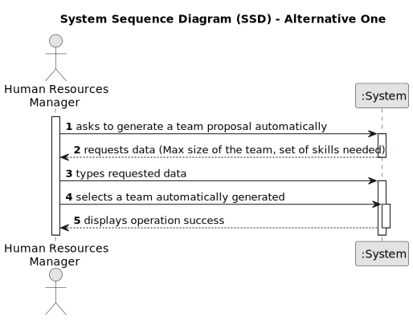

# US005 -  As a HRM, I want to generate a team proposal automatically.

## 1. Requirements Engineering

### 1.1. User Story Description

As a HRM, I want to generate a team proposal automatically.
### 1.2. Customer Specifications and Clarifications 

**From the specifications document:**

>	The max and minimum team size and the set of skills must be supplied by the HRM

**From the client clarifications:**

> **Question:** What information will the customer provide?
>
> **Answer:** The customer provide the max size of the team and a set of skills.

> **Question:** What should the output of the automation be? (should it just store the team proposal or show it to the customer?)  Will the team proposal be a document about all the instructions of each team member/worker?
>
> **Answer:** The systems provide team proposals and HRM can accept of refuse the proposals. In the future (not in this sprint) HRM may decide to edit the team.

### 1.3. Acceptance Criteria

* **AC1:** The maximum team size and the set of skills need to be supplied by the HRM.
* **AC2:** All required fields must be filled in.
* **AC3:** When creating a task with an existing reference, the system must reject such operation and the user must be able to modify the typed reference.

### 1.4. Found out Dependencies

* There is a dependency on US03 and US04.

### 1.5 Input and Output Data

**Input Data:**

* Typed data:
    * Max size of the team;
    * Set of skills needed;

**Output Data:**

* (In)Success of the operation

### 1.6. System Sequence Diagram (SSD)

**_Other alternatives might exist._**

#### Alternative One

### 1.7 Other Relevant Remarks

* The created task stays in a "not published" state in order to distinguish from "published" tasks.