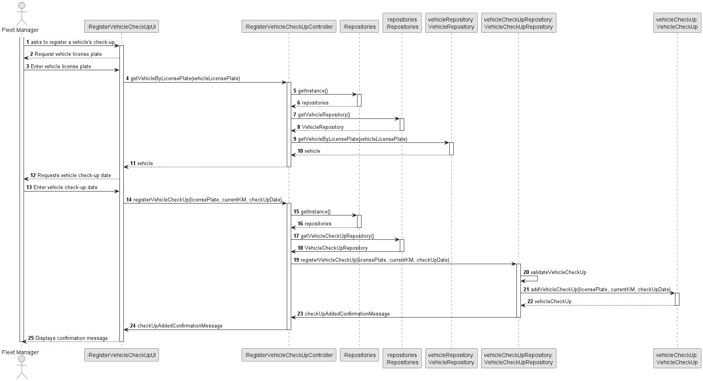
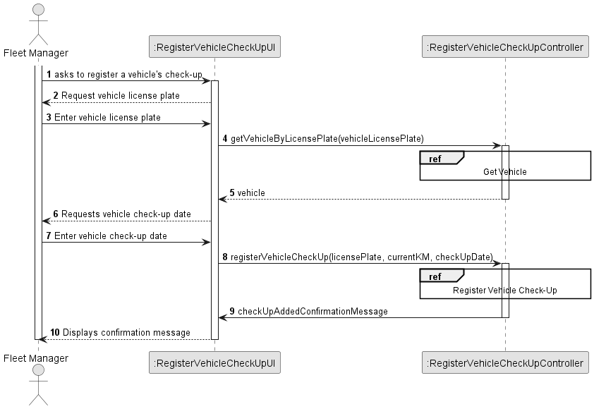
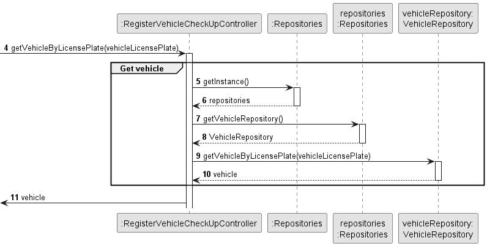
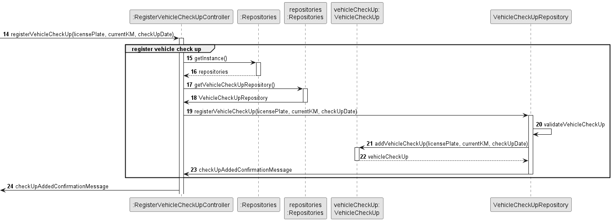
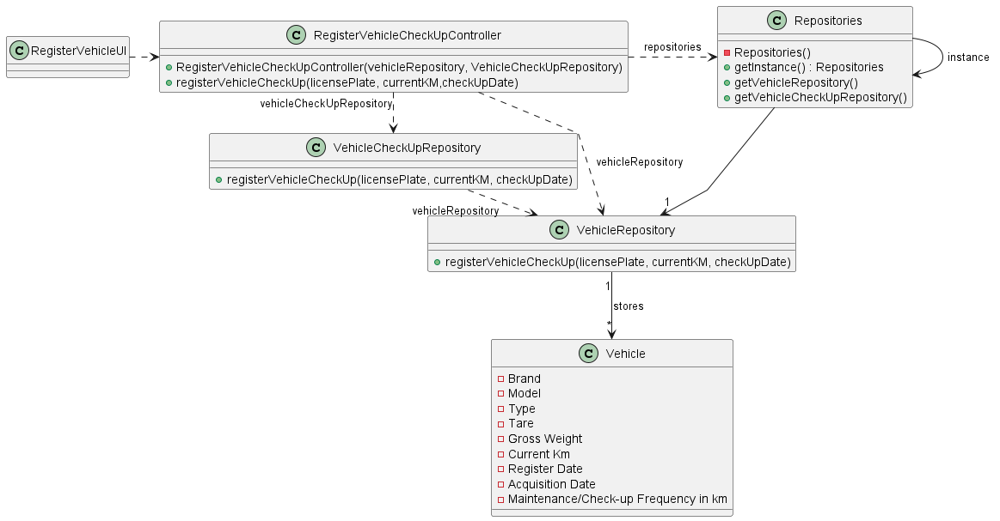

# US006 - Create a Task 

## 3. Design - User Story Realization 

### 3.1. Rationale

_**Note that SSD - Alternative One is adopted.**_

| Interaction ID | Question: Which class is responsible for...  | Answer                           | Justification (with patterns)                                                                                 |
|:---------------|:---------------------------------------------|:---------------------------------|:--------------------------------------------------------------------------------------------------------------|
| Step 1  		     | 	... interacting with the actor?             | RegisterVehicleCheckUpUI         | Pure Fabrication: there is no reason to assign this responsibility to any existing class in the Domain Model. |
| 			  		        | 	... coordinating the US?                    | RegisterVehicleCheckUpController | Controller                                                                                                    |
| 			  		        | 	... registering a new check-up?             | VehicleCheckUpRepository         | IE: This class is designated to save all vehicles check-ups.                                                  |
| Step 2  		     | 	...requesting vehicle ID?				               | RegisterVehicleCheckUpUI         | IE: is responsible for user interactions.                                                                     |
| Step 3  		     | 	...saving the vehicle ID?                   | VehicleCheckUp                   | IE: The class is responsible for saving the introduced information.                                           |
| Step 4  		     | 	...requesting vehicle check-up date?        | RegisterVehicleCheckUpUI         | IE: is responsible for user interactions.                                                                     |
| Step 5  		     | 	... saving the vehicle check-up date?       | VehicleCheckUp                   | IE: The class is responsible for saving the introduced information.                                           |
| Step 6  		 | 	... validating all data (local validation)?  | VehicleCheckUp                   | IE: The VehicleCheckUp object is responsible for validating its own data.                                     |
| 			  		        | 	...registering the vehicle check-up         | VehicleCheckUpRepository         | IE: knows all its vehicles check-ups.                                                                         |
### Systematization ##

According to the taken rationale, the conceptual classes promoted to software classes are: 

* VehicleCheckUp

Other software classes (i.e. Pure Fabrication) identified: 

* RegisterVehicleCheckUpUI
* RegisterVehicleCheckUpController
* VehicleCheckUpRepository

## 3.2. Sequence Diagram (SD)

_**Note that SSD - Alternative Two is adopted.**_

### Full Diagram

This diagram shows the full sequence of interactions between the classes involved in the realization of this user story.

### Split Diagrams

The following diagram shows the same sequence of interactions between the classes involved in the realization of this user story, but it is split in partial diagrams to better illustrate the interactions between the classes.

It uses Interaction Occurrence (a.k.a. Interaction Use).

**Get Vehicle**

**Register Vehicle Check Up**

## 3.3. Class Diagram (CD)

