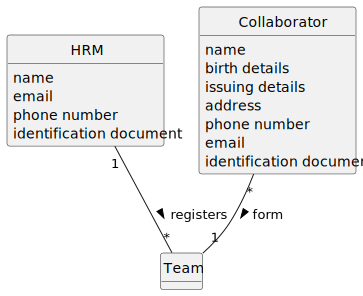

# US013 - As a GSM, I want to apply an algorithm that returns the routes to be opened and pipes needed to be laid with a minimum accumulated cost, ensuring that all points are adequately supplied.

## 2. Analysis

### 2.1. Relevant Domain Model Excerpt 

### 2.2. Other Remarks

n/a