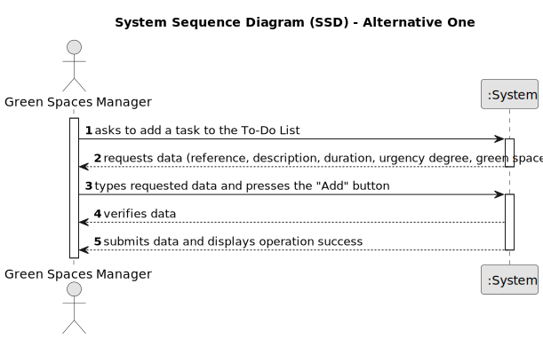

# US021 - Add a task to the To-Do List

## 1. Requirements Engineering

### 1.1. User Story Description

As a GSM, I want to add a new entry to the To-Do List

### 1.2. Customer Specifications and Clarifications 

**From the specifications document:**

>	The To-Do List comprises all the tasks required to
be done in order to assure the proper functioning of the parks. These tasks
can be regular (e.g. pruning trees) or occasional (e.g. repairing a broken
equipment).

**From the client clarifications:**

> **Question:** one task can be associated to more than one green space?
>
> **Answer:** A generic task, yes; like "Prunning Trees" but not a concrete task, like "Prunning Trees" in Parque da Cidade.

> **Question:** Can different tasks have the same title?
>
> **Answer:** A generic task can have the same title but a concrete needs further details. For instance:
Generic Task: "Prunning Trees"
Concrete Task at To-Do List: name(Prunning Trees); park(Arca De Agua); urgency(low); estimated duration(2 working days)

### 1.3. Acceptance Criteria

* **AC1:** The new entry must be associated with a green space managed by the GSM.
* **AC2:** The green space for the new entry should be chosen from a list presented to the GSM

### 1.4. Found out Dependencies

* US020 - Create a Green Space

### 1.5 Input and Output Data

**Input Data:**

* Typed data:
    * Task reference
    * Task description
	
* Selected data:
    * Green space
    * Urgency Degree
 

**Output Data:**

* Success message or error message
* Shows the new task in the To-Do List

### 1.6. System Sequence Diagram (SSD)

[//]: # (**_Other alternatives might exist._**)

#### Alternative One

#### Alternative Two

### 1.7 Other Relevant Remarks

* n/a