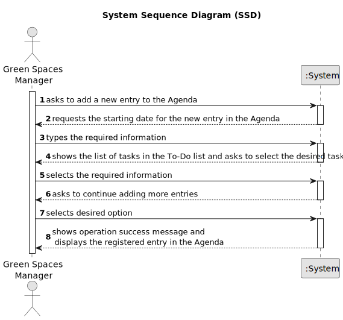

# US022 - Add a new entry in the Angenda

## 1. Requirements Engineering

### 1.1. User Story Description

As a GSM, I want to add a new entry in the Agenda.

### 1.2. Customer Specifications and Clarifications 

**From the specifications document:**

>	" The Agenda is made up of entries that relate to a task (which was previously in the To-Do List),
the team that will carry out the task, the vehicles/equipment assigned to
the task, expected duration, and the status (Planned, Postponed, Canceled,
Done)."

**From the client clarifications:**

> **Question:** when we are registering an entry to the agenda, are the three inputs (selecting an existing task from the to-do list, starting date, and finishing date) sufficient?
>
> **Answer:** The starting date will be enough because the task already has the predicted duration.

> **Question:** When a To-Do List entry is planned and moves to the Agenda, the status change from "Pending" to "Planned". Should this entry be removed from the To-Do List or just change status to "Planned" as it is on the Agenda?
>
> **Answer:** Changing the status in the To-Do list to Planned seems to be a good approach.

> **Question:** When we are registering an entry to the agenda, are the three inputs (selecting an existing task from the to-do list, starting date, and finishing date) sufficient? 
> 
> **Answer:** The starting date will be enough because the task already has the predicted duration.

>**Question:** Can I add an entry that has a time period that already have an existing entry in the Agenda?
> 
> **Answer:** Yes, because:\
a) there are many parks to manage\
b) different tasks can be executed at same time in the same park.

### 1.3. Acceptance Criteria

* **AC1:**  The new entry must be associated with a green space managed by the GSM.
* **AC2:**  The new entry must exist in the To-Do list.

### 1.4. Found out Dependencies

*  Found out dependencies in US020 - "As a Green Space Manager (GSM), I want to register a green
  space (garden, medium-sized park or large-sized park) and its respective
  area."
*  Found out dependencies in US021 - "As a GSM, I want to add a new entry to the To-Do List."

### 1.5 Input and Output Data

**Input Data:**

* Typed data:
    * starting date
* Selected data:
    * a task that exists in the to-do list.

**Output Data:**

* (In)Success of the operation

### 1.6. System Sequence Diagram (SSD)

### 1.7 Other Relevant Remarks

* 