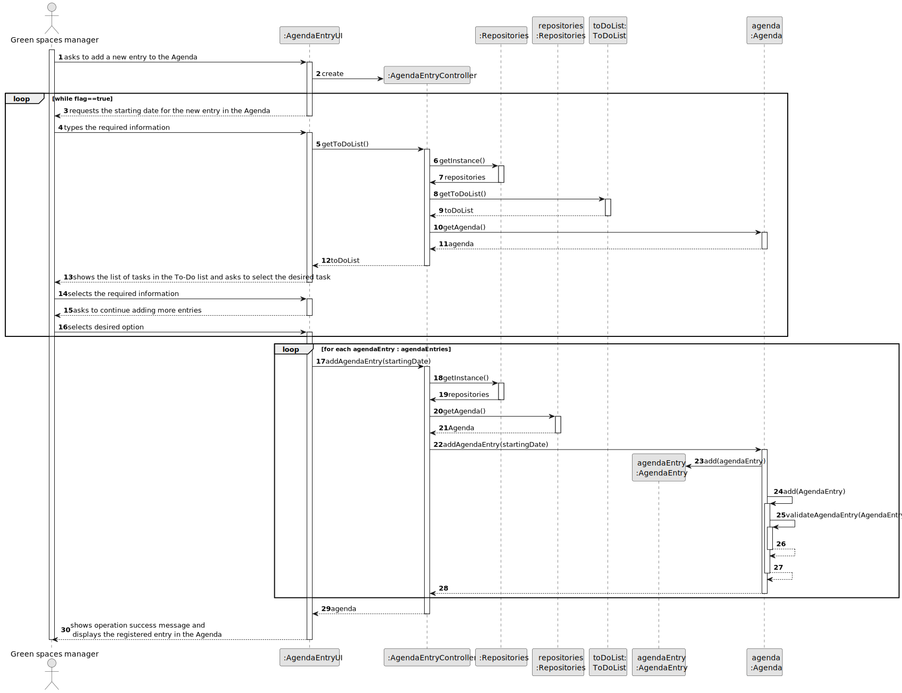
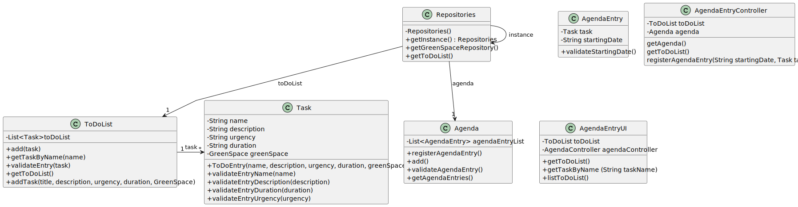

# US022 - Add a new entry in the Angenda

## 3. Design - User Story Realization

### 3.1. Rationale

_**Note that SSD - Alternative One is adopted.**_

| Interaction ID | Question: Which class is responsible for...          | Answer                | Justification (with patterns)                                                                                 |
|:---------------|:-----------------------------------------------------|:----------------------|:--------------------------------------------------------------------------------------------------------------|
| Step 1  		     | 	... interacting with the actor?                     | AgendaEntryUI         | Pure Fabrication: there is no reason to assign this responsibility to any existing class in the Domain Model. |
| 			  		        | 	... coordinating the US?                            | AgendaEntryController | Controller                                                                                                    |
| Step 2  		     | ...obtaining the existing tasks in the To-Do list?   | AgendaEntryController | Controller                                                                                                    |
|                | ... displaying the existing tasks in the To-Do list? | AgendaEntryUI         | IE: is responsible for user interactions.                                                                     |
| Step 3  		     | 	...registering the Agenda entry?                    | Agenda                | Creator(Rule 2):records instances of AgendaEntry.                                                             |
| Step 4  		     | 	... validating all data (local validation)?         | AgendaEntry           | IE: owns its data.                                                                                            | 
| 			  		        | 	... validating all data (global validation)?        | Agenda                | IE: knows all its entries.                                                                                    | 
| 			  		        | 	... saving the created entry in the Agenda?         | Agenda                | IE: owns all its entries.                                                                                     | 
| Step 5  		     | 	... informing operation success?                    | AgendaEntryUI         | IE: is responsible for user interactions.                                                                     | 

### Systematization ##

According to the taken rationale, the conceptual classes promoted to software classes are:

* AgendaEntry

Other software classes (i.e. Pure Fabrication) identified:

* Agenda
* AgendaEntryUI
* AgendaEntryController

## 3.2. Sequence Diagram (SD)

### Full Diagram

This diagram shows the full sequence of interactions between the classes involved in the realization of this user story.

## 3.3. Class Diagram (CD)

