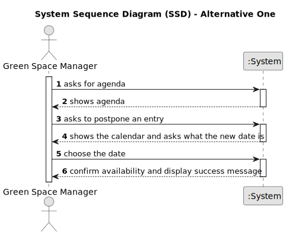

# US024 - As a GSM, I want to Postpone an entry in the Agenda to a specific future date.

## 1. Requirements Engineering

### 1.1. User Story Description

As a GSM, I want to Postpone an entry in the Agenda to a specific future date.

### 1.2. Customer Specifications and Clarifications 

**From the specifications document:**

>	This type of vehicle can be only for passengers or mixed, light or heavy, open box or closed vans or trucks.

**From the client clarifications:**

> **Question:** What are the input to postpone an entry? From my perspective the Green Spaces Manager only needs to select the entry and introduce the new date.

> **Answer:** Yes, you are correct!

> **Question:** As a GSM, I want to Postpone an entry in the Agenda to a future date.
The date you want to postpone in this US24 is the date referring to the "approximate expected duration" field when we registered the task?

> **Answer:** No; sometimes, for various reasons (e.g. insufficient staff, faulty equipment or adverse weather conditions) a task has to be postponed to a new date; task duration is not directly related to this.

### 1.3. Acceptance Criteria

### 1.4. Found out Dependencies

* US21 Because this US regists entries

### 1.5 Input and Output Data

**Input Data:**

* Typed data:
    * New date

**Output Data:**

* Confirmation of new date

### 1.6. System Sequence Diagram (SSD)

#### Alternative One

