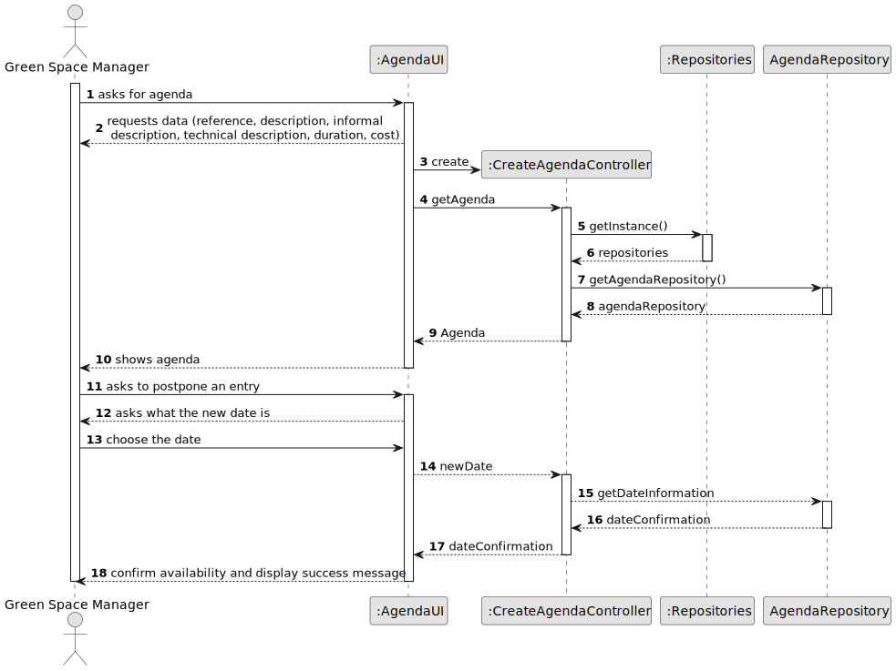
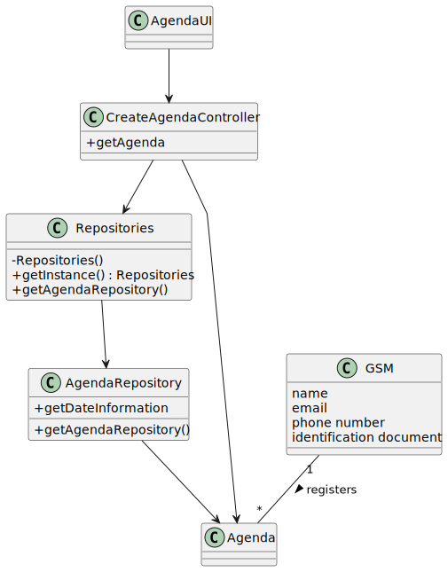

# US024 - As a GSM, I want to Postpone an entry in the Agenda to a specific future date.

## 3. Design - User Story Realization 

### 3.1. Rationale

_**Note that SSD - Alternative One is adopted.**_

| Interaction ID | Question: Which class is responsible for...   | Answer                 | Justification (with patterns)                                                                                 |
|:-------------  |:----------------------------------------------|:-----------------------|:--------------------------------------------------------------------------------------------------------------|
| Step 1  		 | 	... interacting with the actor?              | AgendaUI               | Pure Fabrication: there is no reason to assign this responsibility to any existing class in the Domain Model. |
| 			  		 | 	... coordinating the US?                     | CreateAgendaController | Controller                                                                                                    |
| Step 3  		 | 	...saving the inputted data?                 | AgendaRepository       | IE: object created in step 1 has its own data.                                                                |
| Step 5  		 | 	... saving the selected category?            | AgendaRepository       | IE: object created in step 1 is classified in one Category.                                                   |
| Step 7  		 | 	... validating all data (local validation)?  | AgendaRepository       | IE: owns its data.                                                                                            | 
| 			  		 | 	... saving the created collaborator?         | AgendaRepository       | IE: owns all its tasks.                                                                                       | 
| Step 8  		 | 	... informing operation success?             | AgendaUI               | IE: is responsible for user interactions.                                                                     | 

### Systematization ##

According to the taken rationale, the conceptual classes promoted to software classes are: 

* Agenda

Other software classes (i.e. Pure Fabrication) identified: 

* AgendaUI  
* CreateAgendaController

## 3.2. Sequence Diagram (SD)

_**Note that SSD - Alternative Two is adopted.**_

### Full Diagram

This diagram shows the full sequence of interactions between the classes involved in the realization of this user story.

## 3.3. Class Diagram (CD)

