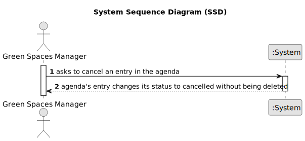

# US025 - Cancel a task.

## 1. Requirements Engineering

### 1.1. User Story Description

As a GSM, I want to Cancel an entry in the Agenda.

### 1.2. Customer Specifications and Clarifications 

**From the specifications document:**

> A canceled task should not be deleted but rather change its
state.

**From the client clarifications:**

> **Question:**  When the GSM wants to cancel a task, this task can only be canceled if its status is PLANNED or POSTPONED, correct?
>
> **Answer:** No, just planned because if there is a Postponed entry then there is also an Planned Entry with the new date.

> **Question:** When a task is cancelled, is it possible to put it back on the agenda again later?\
When we cancel a task, do we move it again to the To-Do List?
>
> **Answer:** When a task is cancelled, is it possible to put it back on the agenda again later?\
yes.\
When we cancel a task, do we move it again to the To-Do List?\
no.

### 1.3. Acceptance Criteria

* **AC1:** A canceled task should not be deleted but rather change its state.

### 1.4. Found out Dependencies

* US022
* US024

### 1.5 Input and Output Data

**Input Data:**

* Selected data: Cancel a task on the Agenda.
 

**Output Data:**

* Status changed to "Cancelled"

### 1.6. System Sequence Diagram (SSD)

**_Other alternatives might exist._**

#### Alternative One

