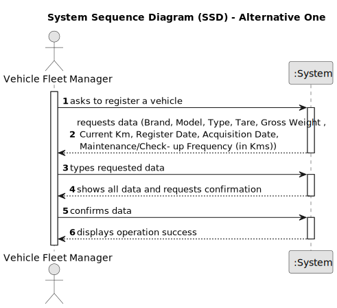

# US026 - As a GSM, I want to assign one or more vehicles to an entry in the Agenda..

## 1. Requirements Engineering

### 1.1. User Story Description

As a GSM, I want to assign one or more vehicles to an entry in the Agenda..

### 1.2. Customer Specifications and Clarifications 

**From the specifications document:**

**From the client clarifications:**

> **Question:** How will the Green Spaces Manager choose the vehicle to assign? By its plate?
>
> **Answer:** Assuming you mean assingning to a Task/Agenda Entry, the data related with vehicle should be provided in order to ease the selection.

> **Question:** Is the number of vehicles to be assigned provided by the Green Spaces Manager?
>
> **Answer:** There is no specification concerning the number of vehicles, is upt to GSM decide what vehicles the task needs.

### 1.3. Acceptance Criteria

### 1.4. Found out Dependencies

* US06 Because this us regists vehicles
* US21 this us regists entries

### 1.5 Input and Output Data

**Input Data:**

* Selected data: Vehicle data
 

**Output Data:**

* Confirmation of car registration

### 1.6. System Sequence Diagram (SSD)

#### Alternative One

