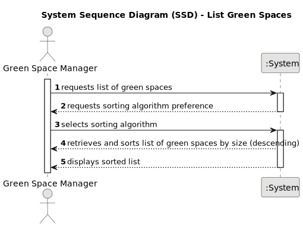

# US027 - List green spaces managed by me.

## 1. Requirements Engineering

### 1.1. User Story Description

As a GSM, I need to list all green spaces managed by me.

### 1.2. Customer Specifications and Clarifications 

**From the specifications document:**

>	This type of vehicle can be only for passengers or mixed, light or heavy, open box or closed vans or trucks.

**From the client clarifications:**

> **Question:** For the application to work does the FM need to fill all the attributes of the vehicle?
>
> **Answer:** yes, besides the vehicle plate that by mistake doesn't appear on the text.

> **Question:** If the Fm inserts the same vehicle by mistake, should it inform ther user of the mistake and give him the option to add another vehicle?
>
> **Answer:** again, duplication of data is not a business rule is technical one, since by definition in a set you cant have duplicates.

### 1.3. Acceptance Criteria

* **AC1:** The list of green spaces must be sorted by size in descending
  order (area in hectares should be used). The sorting algorithm to
  be used by the application must be defined through a configuration
  file. At least two sorting algorithms should be available.

### 1.4. Found out Dependencies

* This user story depends

### 1.5 Input and Output Data

**Input Data:**

* Typed data:
    * Brand, Model, Type, Tare, Gross Weight, Current Km, Register Date, Acquisition Date, Maintenance/Check- up Frequency (in Kms)
	
* Selected data:
 

**Output Data:**

* Confirmation of car data
* Car registration

### 1.6. System Sequence Diagram (SSD)

**_Other alternatives might exist._**

#### Alternative One

#### Alternative Two

!

### 1.7 Other Relevant Remarks

* 