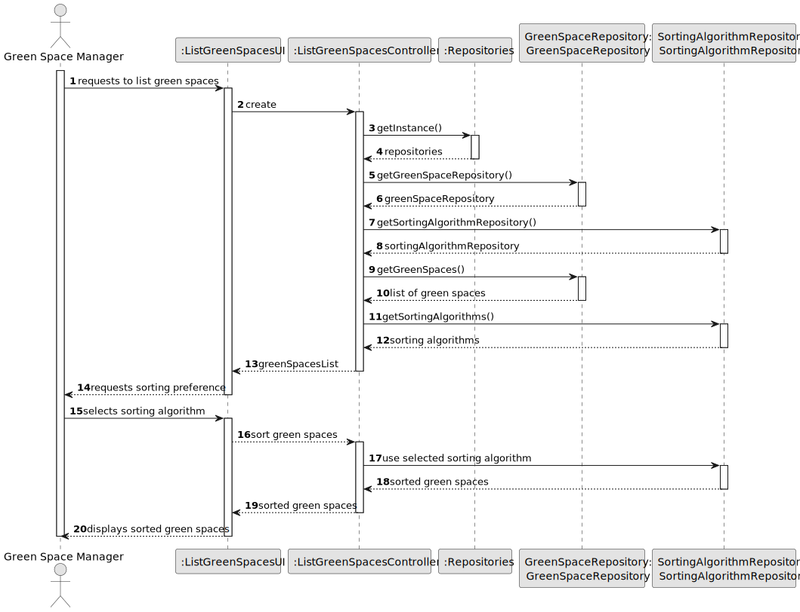
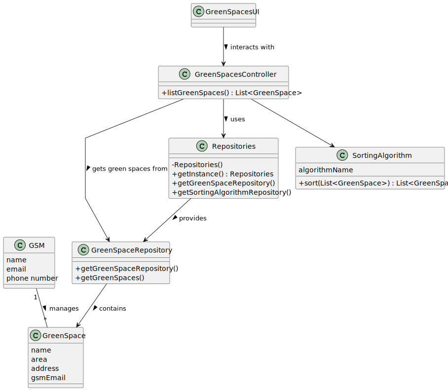

# US027 - List my green spaces. 

## 3. Design - User Story Realization

### 3.1. Rationale

_**Note that SSD - Alternative Two is adopted.**_

| Interaction ID | Question: Which class is responsible for...   | Answer                | Justification (with patterns)                                                                                 |
|:-------------  |:----------------------------------------------|:----------------------|:--------------------------------------------------------------------------------------------------------------|
| Step 1  		 | 	... interacting with the actor?              | GreenSpacesUI         | Pure Fabrication: there is no reason to assign this responsibility to any existing class in the Domain Model. |
| 			  		 | 	... coordinating the US?                     | GreenSpacesController | Controller                                                                                                    |
| Step 3  		 | 	... retrieving green spaces from the repository?                 | GreenSpaceRepository  | Repository Pattern: Responsible for data access.                                                                |
| Step 4  		 | 	... sorting the green spaces?            | SortingAlgorithm      | Strategy Pattern: Different sorting algorithms can be applied.                                                   |
| Step 5  		 | 	... presenting the sorted green spaces?                 | GreenSpacesUI         | IE: Responsible for displaying data to the user.                                                                | 

### Systematization

According to the taken rationale, the conceptual classes promoted to software classes are:

* GreenSpaces
* SortingAlgorithm

Other software classes (i.e. Pure Fabrication) identified:

* GreenSpacesUI
* GreenSpacesController

## 3.2. Sequence Diagram (SD)

### Full Diagram

This diagram shows the full sequence of interactions between the classes involved in the realization of this user story.

## 3.3. Class Diagram (CD)

