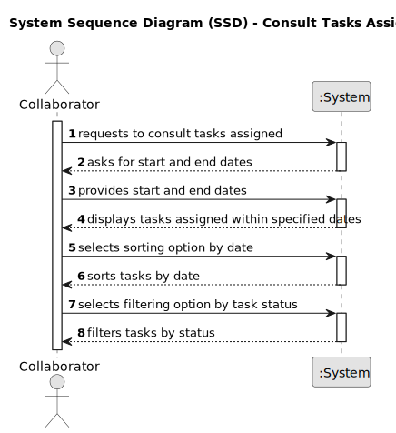

# US028 - R consult the tasks assigned.

## 1. Requirements Engineering

### 1.1. User Story Description

As a Collaborator, I wish to consult the tasks assigned to me
between two dates.

### 1.2. Customer Specifications and Clarifications 

**From the specifications document:**

>	The list of tasks spaces must be sorted by date.

**From the client clarifications:**

> **Question:** When a collaborator is registered, they are given an account with the registered email and a password? This allows them to log in and view their tasks later on. What should be the password for this collaborator's account?
>
> **Answer:** Yes, it make sense.
About the password, not important in this stage of the project.

> **Question:** While consulting tasks, how specific should be data presented to collaborator? Should it be all entries from the agenda with collaborator's team assigned or generic tasks that these entries refer to? As there is agenda entry, to-do list entry and task.
>
> **Answer:** A "generic task" is something like "task type" or "template task", for instance "Prunning Trees".
When a GSM decides to insert a entry in the To-Do list, he selects a generic task, selects a park, defines the expected duration and the urgency.
Later, that To-do List entry will originate an Entry in the Agenda with a starting date/time. That Entry can be managed due to actions/events that happens, hence the Entry can be Canceled, Postponed or Completed.

### 1.3. Acceptance Criteria

* **AC1:** The list of tasks spaces must be sorted by date.
* **AC2:** The Collaborator should be able to filter the results by the
  status of the task.

### 1.4. Found out Dependencies

* This user story has no dependencies

### 1.5 Input and Output Data

**Input Data:**

* Typed data:
	
* Selected data:
  *Select to view the tasks assigned

**Output Data:**

* Tasks assigned to the specific collaborator

### 1.6. System Sequence Diagram (SSD)

**_Other alternatives might exist._**

#### Alternative One

#### Alternative Two

!

### 1.7 Other Relevant Remarks

* 