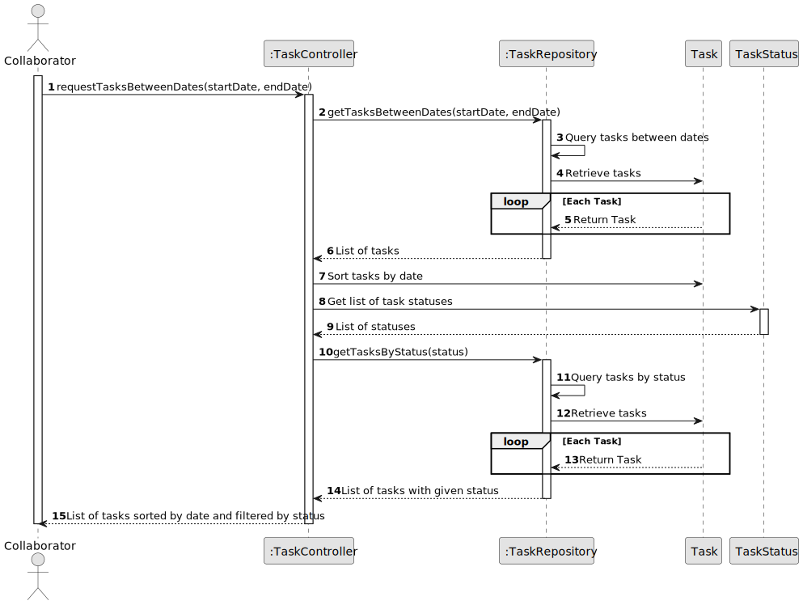
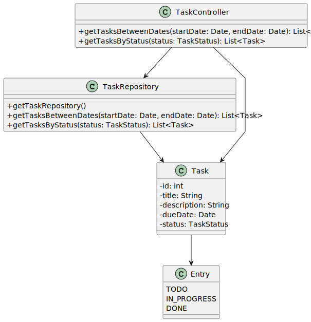

# US006 - Register a vehicle. 

## 3. Design - User Story Realization 

### 3.1. Rationale

For this user story, we need to modify the design and systematization based on the new requirements.

| Interaction ID | Question: Which class is responsible for...   | Answer                  | Justification (with patterns)                                                                                 |
|:---------------|:----------------------------------------------|:------------------------|:--------------------------------------------------------------------------------------------------------------|
| Step 1         |   ... interacting with the actor?              | TaskUI                  | Pure Fabrication: there is no reason to assign this responsibility to any existing class in the Domain Model. |
|                |   ... coordinating the US?                     | TaskController          | Controller                                                                                                    |
| Step 2         |   ... retrieving tasks between two dates?      | TaskRepository          | IE: Object created in step 1 has its own data.                                                                |
| Step 3         |   ... filtering tasks by status?               | TaskRepository          | IE: Object created in step 1 has its own data.                                                                |
| Step 4         |   ... sorting tasks by date?                   | TaskRepository          | IE: Object created in step 1 has its own data.                                                                |
|                |   ... presenting tasks to the collaborator?    | TaskUI                  | IE: Responsible for user interactions.                                                                       | 

### Systematization ##

According to the taken rationale, the conceptual classes promoted to software classes are:

* Task

Other software classes (i.e. Pure Fabrication) identified:

* TaskUI
* TaskController

## 3.2. Sequence Diagram (SD)

_**Note that SSD - Alternative Two is adopted.**_

### Full Diagram

This diagram shows the full sequence of interactions between the classes involved in the realization of this user story.

## 3.3. Class Diagram (CD)

