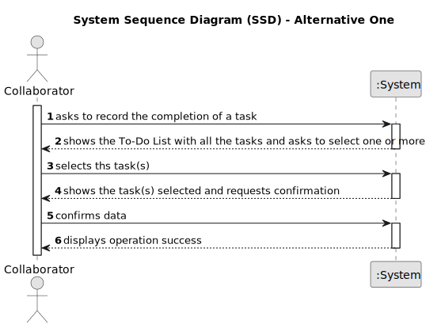

# US029 - Record the completion of a task.

## 1. Requirements Engineering

### 1.1. User Story Description

As a Collaborator, I want to record the completion of a task.

### 1.2. Customer Specifications and Clarifications 

**From the specifications document:**

>	In the daily
management, the GSM uses two essential tools: the Agenda and the Task
List (aka To-Do List). The To-Do List comprises all the tasks required to
be done in order to assure the proper functioning of the parks.

**From the client clarifications:**

> **Question:** The collaborator can see what type of entrys? Like what status can he filter ? Can he see canceled Entry's?
>
> **Answer:** The ones assigned to him. He can filter by the different values the status of the status, like planned, executed, canceled ...

> **Question:** Does the task associated with the Agenda entry in which this happens remain in the To-do List or can it be removed, unlike what happens in the Agenda? Or even, would this process be different between a completed task and a canceled task?
>
> **Answer:** Yes. I suppose when a task goes to the Agenda, it leaves the To-Do list but maybe a different flow could be considered.

### 1.3. Acceptance Criteria

* There are no acceptance criteria for this user story.

### 1.4. Found out Dependencies

* This user story as a dependency on the US021 as there must be at list one task in the 
To-Do List to be recorded as completed.

### 1.5 Input and Output Data

**Input Data:**

* Typed data:
    * None
	
* Selected data:
    * User selects the task he wants to be marked as completed

**Output Data:**

* (In)Success of the operation

### 1.6. System Sequence Diagram (SSD)

**_Other alternatives might exist._**

#### Alternative One

#### Alternative Two

!

### 1.7 Other Relevant Remarks

* 