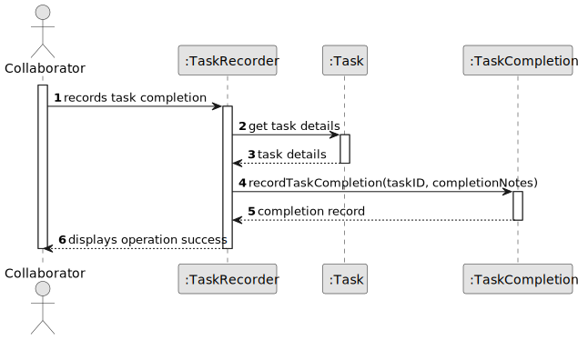
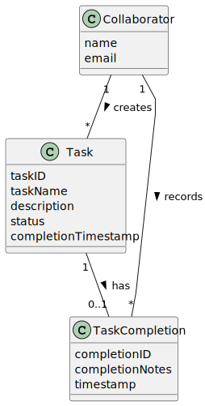

# US029 - Record the completion of a task.

# As a Collaborator, I want to record the completion of a task.

## 3. Design - User Story Realization

### 3.1. Rationale

_**Note that SSD - Alternative One is adopted.**_

| Interaction ID | Question: Which class is responsible for...   | Answer             | Justification (with patterns)                                                                                 |
|:-------------  |:----------------------------------------------|:-------------------|:--------------------------------------------------------------------------------------------------------------|
| Step 1  		 | 	... interacting with the actor?              | AddTaskUI          | Controller: Responsible for coordinating the recording of task completions.                                    |
| Step 2         |  ... retrieving task details?                  | Task               | Entity: Provides details of the task to be completed.                                                          |
| Step 3  		 | 	... recording the completion?                | ToDoListController | Controller: Coordinates the recording of task completions.                                                     |
| Step 4  		 | 	... providing completion feedback?           | ToDoListController       | Controller: Informs the Collaborator about the successful completion of the task.                              |

### Systematization ##

According to the taken rationale, the conceptual classes promoted to software classes are:

* Task
* TaskCompletion

Other software classes (i.e. Pure Fabrication) identified:

* ToDoList

## 3.2. Sequence Diagram (SD)

### Full Diagram

This diagram shows the full sequence of interactions between the classes involved in the realization of this user story.

## 3.3. Class Diagram (CD)

